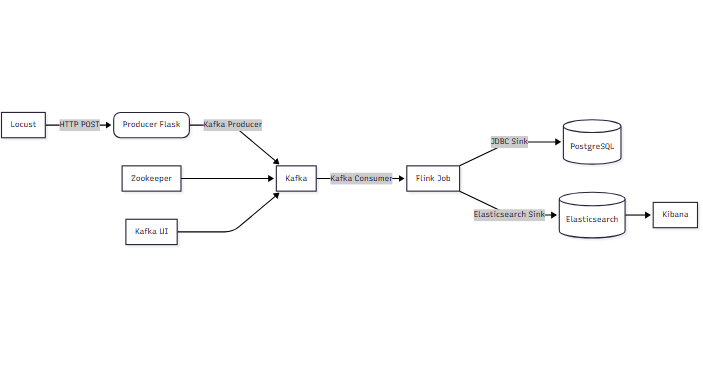

# 🛒 E-commerce Real-Time Stream Processing

**Disciplina**: Arquitetura de Software \
**Curso**: Ciência da Computação \
**Instituição**: Universidade Federal de Campina Grande - UFCG

## 📌 Visão Geral
Este projeto implementa uma pipeline completa de processamento de stream em tempo real para análise de transações de e-commerce. A arquitetura segue os princípios de desacoplamento, escalabilidade, observabilidade e resiliência, utilizando tecnologias modernas de streaming e armazenamento.

- A pipeline simula transações de compras, as processa em janelas de 1 minuto, agrega métricas de vendas e persiste os resultados em dois sistemas distintos:

- PostgreSQL para armazenamento transacional e consultas SQL
Elasticsearch + Kibana para visualização interativa e análise em tempo real

## 🏗️ Arquitetura da Solução


### Componentes

|  COMPONENTE         |                         FUNCÂO                                 |
|---------------------|----------------------------------------------------------------|
| **Locust**          | Gera carga simulando usuários reais (transações de compra)     |
| **Producer**        | API REST (Flask) que recebe transações e envia para o Kafka    |
| **Kafka**           | Sistema de mensageria distribuído (tópico: transactions)       |
| **Zookeeper**       | Coordenação do cluster Kafka (obrigatório na versão 7.4 usada) |
| **Flink**           | Motor de processamento de stream (JobManager + TaskManager)    |
| **PostgreSQL**      | Banco relacional para armazenamento estruturado                |
| **Elasticsearch**   | Motor de busca/análise para dados não estruturado              |
| **Kibana**          | Interface de visualização e dashboard                          |
| **Kafka UI**        | Interface web para monitoramento de tópicos e mensagens        |


## 📦 Estrutura do Projeto
```
ECOMMERCE-STREAM-PROCESSING/
├─ README.md
├─ architecture.png
├─ docker-compose.yml
├─ elasticsearch
│  └─ templates
│     └─ transaction_template.json
├─ flink-job
│  ├─ Dockerfile
│  ├─ SalesAggregationJob.py
│     ├─ flink-connector-jdbc-3.1.2-1.18.jar
│     ├─ flink-connector-kafka-3.0.1-1.18.jar
│     ├─ flink-sql-connector-elasticsearch7-3.1.0-1.18.jar
│     ├─ kafka-clients-3.4.0.jar
│     └─ postgresql-42.6.0.jar
├─ kibana
│  └─ kibana.yml
├─ locust
│  ├─ Dockerfile
│  └─ locustfile.py
├─ postgres
│  └─ init.sql
├─ producer
│  ├─ Dockerfile
│  ├─ producer.py
│  └─ requirements.txt
├─ scripts
│  └─ start-all.sh
└─ tests
   └─ load_test.sh
```


## 🚀 Tecnologias

- Apache Flink
- Kafka
- Locust
- PostgreSQL
- Elasticsearch + Kibana
- Docker + Docker Compose
- GitHub Actions (CI/CD)

## ▶️ Como Executar
Pré-requisitos
- Docker e Docker Compose instalados
- Acesso à internet (para baixar imagens e JARs)

Passo a passo

1. Baixar os conectores necessários (faça isso uma vez):
```bash
# Na pasta raiz do projeto
mkdir -p flink-job/lib

# Conector JDBC
wget https://repo1.maven.org/maven2/org/apache/flink/flink-connector-jdbc/3.1.2-1.18/flink-connector-jdbc-3.1.2-1.18.jar -P flink-job/lib/

# Conector Elasticsearch 7
wget https://repo1.maven.org/maven2/org/apache/flink/flink-sql-connector-elasticsearch7/3.1.0-1.18/flink-sql-connector-elasticsearch7-3.1.0-1.18.jar -P flink-job/lib/

# Driver JDBC do PostgreSQL
wget https://jdbc.postgresql.org/download/postgresql-42.6.0.jar -P flink-job/lib/
```

2. Iniciar toda a stack:
```bash
chmod +x scripts/*.sh
./scripts/start-all.sh
```

3. Acessar os serviços:

|    SERVIÇO          |                    URL                   |
|---------------------|------------------------------------------|
| **Locust**          |     http://localhost:8089                |
| **Kafka UI**        |     http://localhost:8080                |
| **Flink Web UI**    |     http://localhost:8081                |
| **Kibana**          |     http://localhost:5601                |

4. (Opcional) Executar teste de carga manual:
```bash
./scripts/load_test.sh
```

## ✅ Validação da Pipeline

Ele verifica:

- Se há dados na tabela sales_summary do PostgreSQL
- Se há documentos no índice transactions-aggregated do Elasticsearch
- Se o Kibana está respondendo

Resultado esperado: 🎉 **PIPELINE VALIDADA COM SUCESSO!**


## 📊 Visualização no Kibana
1. Acesse http://localhost:5601

2. Vá em Stack Management → Data Views → Create data view
    - Name: transactions-*
    - Index pattern: transactions-*
    - Timestamp field: @timestamp
3. Vá em Analytics → Discover e explore os dados

4. Crie dashboards com:
    - Receita total por categoria
    - Vendas por método de pagamento
    - Evolução temporal de vendas

## 🧪 Testes Automatizados

Na raiz do projeto, rode o seguinte comando para rodar os testes:
```bash
./tests/load_test.sh
python tests/validate_pipeline.py
```

## 🛠️ Tecnologias Utilizadas

|      CATEGORIA           |           TECNOLOGIA        |  VERSÂO  |
|--------------------------|-----------------------------|----------|
| **Mensageria**           | Apache Kafka + Zookeeper    | 7.4.0    |
| **Processamento**        | Apache Flink (PyFlink)      | 1.18.1   |
| **Armazenamento**        | PostgreSQL                  | 17       |
| **Busca/Visualização**   | Elasticsearch + Kibana      | 8.11.0   | 
| **Geração de Carga**     | Locust                      | 2.25.0   |
| **API**                  | Flask                       | 2.3.3    |
| **Orquestração**         | Docker Compose              |    --    |


## 👥 Contribuidores
- Matheus Victor Pereira
- Aline de Brito das Neves
- Johansson Lucena
- Igor Ribeiro de Souza
- Erick Araken Vieira Gomes


## 📚 Referências
- Apache Flink Documentation: https://nightlies.apache.org/flink/flink-docs-release-1.18/
- Elasticsearch + Flink Connector: https://nightlies.apache.org/flink/flink-docs-release-1.18/docs/connectors/datastream/elasticsearch/
- Locust: https://locust.io/
- Kafka UI: https://github.com/kafbat/kafka-ui